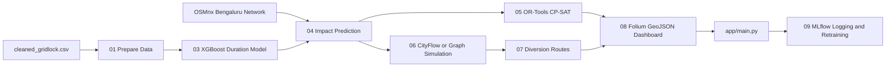

# Bengaluru Event-Driven Congestion Management System

Production-ready Python 3.10+ pipeline for predicting event impact duration, identifying affected roads, optimizing police deployment, recommending barricades and diversions, visualizing response plans, and logging outcomes for continuous learning.



## Quick Start

```bash
cd event_traffic_system
python -m venv .venv
. .venv/Scripts/activate
pip install -r requirements.txt
bash run_all.sh
streamlit run app/main.py
```

The pipeline expects `../cleaned_gridlock.csv`, matching the workspace layout. Outputs are written to `output/predictions` and `output/dashboards`.

Important data note: the CSV does not contain an event end or resolution timestamp. The trained ML model therefore learns `report_creation_delay_min`, which is the delay between `start_datetime` and `created_date`. The response plan uses a transparent operational risk estimator for `predicted_duration_min` until true outcome durations are logged.

## Public Deployment

The Streamlit app is deployment-ready for GitHub-backed hosts. Runtime artifacts such as trained models, GraphML road networks, prediction JSON, dashboards, MLflow local state, and logs are intentionally ignored by Git. On first start, `app/main.py` calls `lib.bootstrap.ensure_runtime_artifacts()` and rebuilds missing artifacts from `data/cleaned_gridlock.csv`.

### Streamlit Community Cloud

1. Push the `event_traffic_system` folder as the repository root, or set the app path to `event_traffic_system/app/main.py` if this folder lives inside a larger repo.
2. Ensure `data/cleaned_gridlock.csv`, `requirements.txt`, `packages.txt`, and `runtime.txt` are committed.
3. Create a new Streamlit app from GitHub.
4. Set the main file path to:

```text
streamlit_app.py
```

If deploying from the parent `flipkart` repository instead, set:

```text
event_traffic_system/streamlit_app.py
```

The first load may take longer while the app prepares data, builds/downloads the OSMnx network, trains the model, and creates default response artifacts. If OSMnx cannot reach Overpass, the project falls back to the deterministic Bengaluru graph.

### Render

Render can use `render.yaml` directly:

```bash
git push origin main
```

Then create a Render Blueprint from the repository. The service runs:

```bash
streamlit run app/main.py --server.address=0.0.0.0 --server.port=$PORT
```

### Docker

```bash
docker build -t bengaluru-congestion .
docker run --rm -p 8501:8501 bengaluru-congestion
```

Open `http://localhost:8501`.

### Do Not Commit

The following are local/generated and should stay out of Git:

- `venv/` or `.venv/`
- `mlruns/`, `mlflow.db`, `mlruns_fallback.jsonl`
- `output/runtime/`, `output/predictions/`, `output/dashboards/`
- `models/*.pkl`
- `road_network/*.graphml`
- Python cache directories

## Live Pipeline Monitor

Start the dependency-free operations dashboard on Windows:

```powershell
.\run_monitor.ps1
```

Or start it directly:

```bash
python app/realtime_monitor.py 8765
```

Open `http://127.0.0.1:8765`. The monitor can start and stop the pipeline, displays each running script, streams combined stdout/stderr, shows model and response metrics, and links every generated artifact. Runtime state and logs are persisted under `output/runtime`.

## Scripts

- `01_prepare_data.py` parses dates, computes `actual_duration_min`, engineers temporal features, encodes boolean/ordinal fields, and writes `data/train_data.csv`.
- `02_build_network.py` downloads the Bengaluru drive network with OSMnx and saves `road_network/bangalore_graph.graphml`; if download fails, it saves a deterministic Bengaluru fallback graph.
- `03_train_duration_model.py` trains `XGBRegressor(enable_categorical=True)`, reports MAE, RMSE, and R2, and saves `models/duration_model.pkl`.
- `04_predict_impact.py` predicts duration and identifies affected roads through corridor propagation, 1 km proximity search, and adjacent edge expansion.
- `05_manpower_optimizer.py` uses OR-Tools CP-SAT and graph centrality to maximize intersection coverage for available officers.
- `06_barricade_simulator.py` uses CityFlow when importable and otherwise applies a graph-based congestion, throughput, and travel-time scorer across three plans.
- `07_diversion_routes.py` removes selected closed edges and computes travel-time weighted alternative routes.
- `08_generate_dashboard.py` writes GeoJSON and `dashboard.html` using Folium.
- `09_mlflow_logger.py` logs metrics, parameters, artifacts, predictions, and supports threshold-based retraining.

## CityFlow And Docker

CityFlow is optional because Windows builds can be environment-sensitive. To use native CityFlow, install it in the same environment and place `roadnet.json`, `flow.json`, and `config.json` in `config/cityflow_config`. The simulator automatically falls back to the Python graph engine when CityFlow is unavailable.

```bash
docker build -t bengaluru-congestion .
docker run --rm -p 8501:8501 -v "%cd%/../cleaned_gridlock.csv:/cleaned_gridlock.csv" bengaluru-congestion
```

Inside the container, copy or mount the CSV so `run_all.sh` can read it from the expected parent path, or call `01_prepare_data.py --input /cleaned_gridlock.csv`.

## MLflow Retraining

```bash
python scripts/09_mlflow_logger.py --mode log-latest
python scripts/09_mlflow_logger.py --mode retrain-if-needed --threshold-mae 30
```

Cron example:

```cron
0 2 * * * cd /opt/event_traffic_system && /usr/bin/python scripts/09_mlflow_logger.py --mode retrain-if-needed --threshold-mae 30
*/30 * * * * cd /opt/event_traffic_system && /usr/bin/python scripts/09_mlflow_logger.py --mode log-latest
```

## Streamlit Dashboard

`app/main.py` provides event entry, impact prediction, manpower recommendation, barricade selection, diversion generation, interactive map rendering, outcome logging, and MLflow integration from one screen.

The map renders affected roads, affected intersections, numbered police deployment points, all barricade plan layers, recommended closures, diversion routes, and an on-map legend. Click a road, marker, or route for its explanation and metrics.

## Bernoulli-Tension Diversion

The automatic diversion stage includes an experimental fluid-dynamics heuristic. Each road edge is treated as a flow channel with a Bernoulli-like potential:

```text
density = capacity_factor / predicted_speed
P = alpha * min(density / capacity_norm, 1.0) + beta * delay_penalty
E = 0.5 * k * predicted_speed^2 + P
```

Where:

- `P` is traffic pressure.
- `E` is the route potential used by Dijkstra search.
- `k` controls the kinetic term.
- `alpha` controls density pressure.
- `beta` controls delay penalty.

High-tension nodes are detected where a high-pressure edge touches a lower-pressure neighbour. The system then computes Bernoulli-optimal diversion routes from those nodes to major exit nodes using edge weight `E`. These routes are written to `auto_diversion_routes` in `output/predictions/diversion_routes.json` and displayed as dashed blue lines on the map. The pressure field is displayed as green/yellow/red road segments and can be toggled in Streamlit.

This is an experimental traffic-fluid analogy, not a calibrated microscopic traffic-flow model. Tune `k`, `alpha`, and `beta` against real outcomes before operational use.

SUMO integration is optional. SUMO is a microscopic traffic simulator with tools such as `netconvert`, `duarouter`, and Python/TraCI support. If local SUMO binaries and a SUMO network file exist under `config/sumo_config/bangalore.net.xml`, the diversion stage records SUMO capability; otherwise it falls back to the NetworkX Bernoulli simulation.
