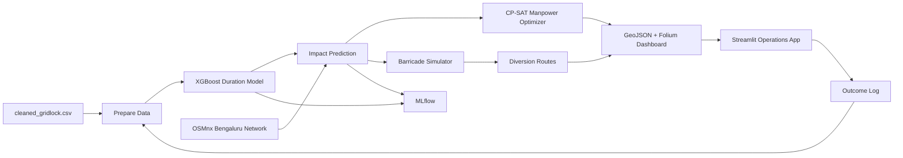

# Bengaluru Event-Driven Congestion Management System

Production-ready Python 3.10+ pipeline for predicting traffic impact duration, identifying affected roads, optimizing police deployment, recommending barricades and diversions, simulating response plans, and visualizing outputs.

## Architecture



## Setup

```bash
python -m venv .venv
source .venv/bin/activate
pip install -r requirements.txt
cp /path/to/cleaned_gridlock.csv data/cleaned_gridlock.csv
```

On Windows PowerShell:

```powershell
python -m venv .venv
.\.venv\Scripts\Activate.ps1
pip install -r requirements.txt
Copy-Item C:\path\to\cleaned_gridlock.csv data\cleaned_gridlock.csv
```

## Run Full Workflow

```bash
bash run_all.sh
```

Each script also runs independently:

```bash
python scripts/01_prepare_data.py
python scripts/02_build_network.py
python scripts/03_train_duration_model.py
python scripts/04_predict_impact.py --start-datetime "2026-06-20 18:30:00" --latitude 12.9716 --longitude 77.5946 --event-cause accident --priority high --corridor "MG Road"
python scripts/05_manpower_optimizer.py --available-officers 40
python scripts/06_barricade_simulator.py
python scripts/07_diversion_routes.py
python scripts/08_generate_dashboard.py
python scripts/09_mlflow_logger.py
```

## Local Notebook Training

Start Jupyter and open `notebooks/train_duration_model.ipynb`:

```bash
jupyter lab
```

The notebook uses the same training function as `scripts/03_train_duration_model.py`, so notebook and pipeline results remain consistent.

## Streamlit App

```bash
streamlit run app/main.py
```

The app provides event entry, impact prediction, manpower recommendation, barricade selection, diversion generation, interactive map display, outcome logging, and MLflow logging.

## CityFlow

The simulator automatically uses CityFlow when the `cityflow` Python package is importable. If CityFlow is not installed, it uses a deterministic NetworkX graph-scoring fallback.

Docker example for CityFlow experimentation:

```bash
docker run --rm -it -v "$PWD:/workspace" -w /workspace python:3.10 bash
apt-get update && apt-get install -y build-essential cmake git
pip install -r requirements.txt
pip install cityflow
python scripts/06_barricade_simulator.py
```

Minimal CityFlow config files live in `config/cityflow_config/`. Replace them with calibrated Bengaluru signal, lane, and flow files when operational signal data is available.

## MLflow and Retraining

```bash
python scripts/09_mlflow_logger.py --retrain
mlflow ui --backend-store-uri ./mlruns
```

Cron examples:

```cron
0 2 * * * cd /opt/event_traffic_system && . .venv/bin/activate && python scripts/09_mlflow_logger.py --retrain
*/30 * * * * cd /opt/event_traffic_system && . .venv/bin/activate && python scripts/09_mlflow_logger.py
```

## Outputs

- `data/train_data.csv`
- `road_network/bangalore_graph.graphml`
- `models/duration_model.pkl`
- `output/predictions/latest_prediction.json`
- `output/predictions/manpower_plan.json`
- `output/predictions/barricade_plan.json`
- `output/predictions/diversion_routes.json`
- `output/dashboards/latest_traffic_plan.geojson`
- `output/dashboards/dashboard.html`
