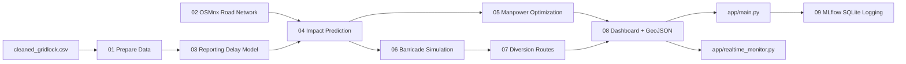

# Repository Cleanup Report

## 1. Executive Summary

### Project overview

The repository implements a Bengaluru event-driven congestion management system. It ingests `cleaned_gridlock.csv`, prepares event features, builds an OpenStreetMap road graph, trains a timestamp-derived model, predicts event impact, recommends police deployment, simulates barricade plans, generates diversion routes, renders map dashboards, and logs runs through MLflow.

Primary user-facing entry points:

- `app/main.py`: Streamlit event experimentation dashboard.
- `app/realtime_monitor.py`: dependency-light live pipeline monitor.
- `run_all.sh`: Linux/macOS batch workflow.
- `run_monitor.ps1`: Windows live monitor launcher.
- `scripts/01_prepare_data.py` through `scripts/09_mlflow_logger.py`: independently runnable pipeline stages.

### Cleanup goals

- Remove generated and obsolete artifacts that should not be maintained as source.
- Consolidate duplicated runtime logging/state code.
- Clean direct dependencies to packages actively used by the source.
- Preserve existing execution paths and operational behavior.
- Document architecture, data-quality limitations, risks, and validation status.

### Overall findings

- The repository is structurally coherent: scripts are staged clearly and the two dashboards use shared outputs.
- Several generated folders were present in source space: source `__pycache__`, OSMnx cache, and an obsolete MLflow file-store directory.
- Runtime state/logging code was duplicated between the Streamlit dashboard and live monitor.
- `requirements.txt` included direct packages not imported by the project (`keplergl`, `pydantic`, `python-dateutil`) and old exact pins that conflicted with the available Python 3.14 environment.
- The dataset has no real event end/resolution timestamp. The trained model can learn reporting delay only; this is now documented in code outputs and README.

## 2. Architecture Overview

### High-level system architecture



### Folder structure

- `app/`: interactive dashboards.
- `scripts/`: numbered pipeline stages.
- `lib/`: shared path, data, graph, map, logging, and runtime-state utilities.
- `data/`: prepared training data artifact.
- `road_network/`: OSMnx GraphML artifact.
- `models/`: trained model and metric artifacts.
- `output/predictions/`: prediction, manpower, barricade, and diversion JSON artifacts.
- `output/dashboards/`: Folium/GeoJSON dashboard artifacts.
- `output/runtime/`: live monitor state and logs.
- `config/cityflow_config/`: optional CityFlow configuration documentation.

### Major modules/services

- `lib.data_utils`: schema normalization and feature engineering.
- `lib.network_utils`: road graph loading, fallback graph, geometry, JSON IO, distance helpers.
- `lib.map_utils`: shared Folium response-map rendering.
- `lib.runtime_state`: shared runtime state and log file management.
- `scripts/03_train_duration_model.py`: trains the available timestamp-derived model.
- `scripts/04_predict_impact.py`: produces event-sensitive operational impact estimates and affected roads.
- `scripts/05_manpower_optimizer.py`: allocates police officers using OR-Tools CP-SAT with a fallback allocator.
- `scripts/06_barricade_simulator.py`: compares closure plans by congestion, throughput, and safety risk.
- `scripts/07_diversion_routes.py`: generates closure-specific alternative routes.
- `scripts/08_generate_dashboard.py`: produces GeoJSON and HTML map dashboards.
- `scripts/09_mlflow_logger.py`: logs to MLflow SQLite, with a JSONL fallback when MLflow is unavailable.

### Data flow

1. Raw CSV is prepared into `data/train_data.csv`.
2. OSMnx creates `road_network/bangalore_graph.graphml`.
3. Model training writes `models/duration_model.pkl` and `models/duration_metrics.json`.
4. Event prediction writes `output/predictions/latest_prediction.json`.
5. Manpower, barricade, and diversion scripts consume the prediction and write their own JSON outputs.
6. Dashboard generation merges prediction outputs into map artifacts.
7. MLflow logs parameters, metrics, prediction artifacts, and model artifacts.
8. The live monitor reads `output/runtime/pipeline_state.json` and `output/runtime/pipeline.log`.

### External integrations

- OpenStreetMap Overpass via OSMnx.
- XGBoost for the available learned timestamp model.
- OR-Tools CP-SAT for manpower optimization.
- Folium and Streamlit-Folium for maps.
- Streamlit for event experimentation.
- MLflow with SQLite backend.
- CityFlow is optional; graph fallback remains available.

### Dependency graph summary

- `app/main.py` depends on Streamlit, Folium, streamlit-folium, and shared `lib`.
- `app/realtime_monitor.py` depends only on Python standard library plus `lib.runtime_state`.
- `scripts/*` depend on shared `lib` modules and selected stage-specific packages.
- `osmnx` brings geospatial transitive dependencies including GeoPandas, Shapely, and PyProj.

## 3. Cleanup Actions Performed

| File path | Change type | Detailed reasoning | Impact assessment |
|---|---|---|---|
| `lib/runtime_state.py` | Consolidated | Added one shared runtime-state/logging module for monitor and Streamlit response runs. | Removes duplicate runtime file handling and keeps live logs consistent across dashboards. |
| `app/main.py` | Refactored | Replaced duplicated runtime log/state helpers with imports from `lib.runtime_state`. | Preserves Streamlit behavior while reducing maintenance surface. |
| `app/realtime_monitor.py` | Refactored | Replaced duplicated runtime log/state helpers with imports from `lib.runtime_state`; uses project `venv` Python when present. | Full pipeline runs from the monitor now use the same installed stack as Streamlit. |
| `lib/map_utils.py` | Consolidated | Centralized response-map rendering for Streamlit and static dashboard generation. | Prevents divergent map behavior between UI and generated HTML. |
| `scripts/08_generate_dashboard.py` | Refactored | Uses `lib.map_utils.build_response_map`; GeoJSON barricades now include real geometry. | All map artifacts are explained and visible consistently. |
| `requirements.txt` | Refactored | Removed unused direct dependencies and replaced stale exact pins with supported ranges. | Cleaner install contract; avoids Python-version conflicts observed during validation. |
| `.dockerignore` | Refactored | Added generated cache, local DB, and fallback log exclusions. | Reduces Docker context size and prevents local runtime data from entering images. |
| `README.md` | Refactored | Documented the timestamp limitation and map artifact layers. | Prevents misinterpretation of the trained model as true congestion-duration learning. |
| `app/__pycache__/` | Removed | Generated Python bytecode, not source. | No runtime impact; regenerated automatically if needed. |
| `lib/__pycache__/` | Removed | Generated Python bytecode, not source. | No runtime impact. |
| `scripts/__pycache__/` | Removed | Generated Python bytecode, not source. | No runtime impact. |
| `cache/` | Removed | OSMnx HTTP cache generated during network download attempts. | No functional impact; OSMnx can regenerate cache. |
| `mlruns/` previous contents | Removed | Obsolete file-store run contents from before SQLite migration. | MLflow SQLite remains authoritative. MLflow may recreate `mlruns/` as an artifact directory. |
| `output/predictions/sensitivity_low.json` | Removed | Temporary validation artifact created during sensitivity testing. | No user-facing behavior impact. |
| `output/predictions/sensitivity_critical.json` | Removed | Temporary validation artifact created during sensitivity testing. | No user-facing behavior impact. |

## 4. Dead Code Analysis

### Unused functions removed

- Duplicate runtime helper implementations in `app/main.py` and `app/realtime_monitor.py` were removed and replaced by `lib/runtime_state.py`.

### Unused classes removed

- No unused classes were present in source.

### Unused files removed

- Source bytecode cache directories:
  - `app/__pycache__/`
  - `lib/__pycache__/`
  - `scripts/__pycache__/`
- Generated OSMnx cache:
  - `cache/`
- Temporary validation JSON files:
  - `output/predictions/sensitivity_low.json`
  - `output/predictions/sensitivity_critical.json`

### Unused assets removed

- No static image/vector assets existed.
- Old MLflow file-store run data was purged after SQLite logging was validated.

### Duplicate implementations removed

- Runtime state creation, runtime log writing, runtime log reset, and UTC timestamp helpers were consolidated into `lib/runtime_state.py`.
- Response map visualization was consolidated into `lib/map_utils.py`.

## 5. Dependency Analysis

### Dependencies currently used

- `pandas`: CSV ingestion and feature preparation.
- `numpy`: numeric missing-value handling and model preparation support.
- `scikit-learn`: metrics, train/test split, fallback pipeline.
- `xgboost`: reporting-delay model.
- `osmnx`: OSM road-network download/load/save.
- `networkx`: graph routing, centrality-like scoring, path search.
- `geopandas`, `shapely`, `pyproj`: direct geospatial runtime dependencies used by OSMnx.
- `ortools`: CP-SAT police deployment optimization.
- `mlflow`: run logging and model artifact tracking.
- `streamlit`: event experimentation dashboard.
- `folium`: map rendering.
- `streamlit-folium`: Folium integration inside Streamlit.
- `joblib`: model serialization.

### Dependencies removed

- `keplergl`: not imported or used by any source file.
- `pydantic`: not imported or used directly.
- `python-dateutil`: not imported directly; date parsing is handled by pandas.

### Reason for removal

The removed dependencies had no direct source references and were not required by any execution path. Transitive dependencies should be managed by the packages that require them rather than pinned as project-level dependencies.

### Potential future dependencies

- `cityflow`: only if native CityFlow simulation becomes mandatory.
- `pytest`: recommended when formal tests are added.
- `ruff`: recommended for automated unused-import and style enforcement.

## 6. Architecture Improvements

### Before vs After structure

Before:

```text
app/
  main.py                 # Streamlit UI plus duplicated runtime logging
  realtime_monitor.py     # Monitor plus duplicated runtime logging
lib/
  data_utils.py
  network_utils.py
scripts/
  01..09 pipeline stages
generated caches mixed into source folders
```

After:

```text
app/
  main.py
  realtime_monitor.py
lib/
  data_utils.py
  logging_utils.py
  map_utils.py            # shared map rendering
  network_utils.py
  paths.py
  runtime_state.py        # shared runtime state/logging
scripts/
  01..09 pipeline stages
generated caches removed from source folders
```

### Design improvements

- Runtime log/state management now has one owner.
- Map rendering now has one owner.
- Dependency file reflects active direct imports.
- Docker build context excludes local/generated runtime data.
- README documents the most important model-data limitation.

### Maintainability gains

- Lower risk of Streamlit and monitor logs drifting apart.
- Lower risk of inconsistent map legends/layers between live UI and static dashboard.
- Cleaner dependency maintenance and fewer avoidable install conflicts.
- Generated files no longer obscure source review.

## 7. Risk Assessment

### Potential areas requiring manual verification

- OSMnx network download depends on external Overpass availability and may require network permission.
- MLflow may recreate `mlruns/` as an artifact storage directory even though tracking metadata is now SQLite-backed.
- The project has no formal automated test suite; validation was command-based.
- The source CSV lacks true event end/resolution timestamps, so true congestion-duration learning cannot be validated without additional outcome data.
- `venv/` was intentionally retained because it is the working local environment used by the active dashboards.

### Assumptions made during cleanup

- Generated artifacts under `data/`, `models/`, `road_network/`, and `output/` are useful for local experimentation and should be preserved.
- Removing source bytecode caches is safe because Python regenerates them automatically.
- Removing OSMnx HTTP cache is safe because it is not required to run with the already saved GraphML.
- Direct dependency cleanup should not remove geospatial packages required by OSMnx at runtime.

## 8. Final Repository Structure

Generated-heavy directories such as `venv/` and MLflow artifact internals are intentionally omitted from this tree.

```text
event_traffic_system/
├── .dockerignore
├── Dockerfile
├── README.md
├── REPOSITORY_CLEANUP_REPORT.md
├── requirements.txt
├── run_all.sh
├── run_monitor.ps1
├── mlflow.db
├── mlruns_fallback.jsonl
├── app/
│   ├── main.py
│   └── realtime_monitor.py
├── config/
│   └── cityflow_config/
│       └── README.md
├── data/
│   └── train_data.csv
├── lib/
│   ├── __init__.py
│   ├── data_utils.py
│   ├── logging_utils.py
│   ├── map_utils.py
│   ├── network_utils.py
│   ├── paths.py
│   └── runtime_state.py
├── models/
│   ├── duration_metrics.json
│   └── duration_model.pkl
├── output/
│   ├── dashboards/
│   │   ├── dashboard.geojson
│   │   └── dashboard.html
│   ├── predictions/
│   │   ├── barricade_plan.json
│   │   ├── diversion_routes.json
│   │   ├── latest_prediction.json
│   │   └── manpower_plan.json
│   └── runtime/
│       ├── monitor.stderr.log
│       ├── monitor.stdout.log
│       ├── pipeline.log
│       ├── pipeline_state.json
│       ├── streamlit.stderr.log
│       └── streamlit.stdout.log
├── road_network/
│   └── bangalore_graph.graphml
└── scripts/
    ├── 01_prepare_data.py
    ├── 02_build_network.py
    ├── 03_train_duration_model.py
    ├── 04_predict_impact.py
    ├── 05_manpower_optimizer.py
    ├── 06_barricade_simulator.py
    ├── 07_diversion_routes.py
    ├── 08_generate_dashboard.py
    └── 09_mlflow_logger.py
```

## 9. Metrics

- Files/folders removed:
  - 3 source `__pycache__` directories.
  - 1 OSMnx cache directory containing 2 generated files.
  - Previous MLflow file-store contents containing 39 generated files.
  - 2 temporary sensitivity-test JSON files.
- Approximate generated data removed before validation recreation: 482 MB.
- Source files added:
  - `lib/runtime_state.py`
  - `REPOSITORY_CLEANUP_REPORT.md`
- Duplicate modules consolidated:
  - 1 runtime state/logging implementation.
  - 1 map rendering implementation.
- Direct dependencies removed:
  - 3 (`keplergl`, `pydantic`, `python-dateutil`).
- Current non-venv project/source-artifact files: 42.
- Current source/documentation line count outside `venv` and generated MLflow internals: approximately 2,077 lines.
- Estimated maintenance improvement:
  - Medium. The project now has clearer ownership of runtime state and map rendering, fewer direct dependencies, and less generated noise in the source tree.

## 10. Conclusion

The repository is now cleaner and easier to maintain. The principal cleanup wins are removing generated clutter, consolidating duplicated runtime and map logic, documenting the timestamp-data limitation, and reducing the direct dependency surface.

Remaining recommendations:

- Add formal tests for each pipeline stage.
- Add a small fixture GraphML for deterministic CI without network access.
- Add a real event outcome schema with resolution/end timestamps so the model can learn actual congestion duration.
- Add `ruff` or similar static analysis to enforce unused-import and dead-code cleanup continuously.
- Decide whether runtime artifacts (`data/`, `models/`, `road_network/`, `output/`) should be committed, ignored, or managed as external artifacts in a production repository.
